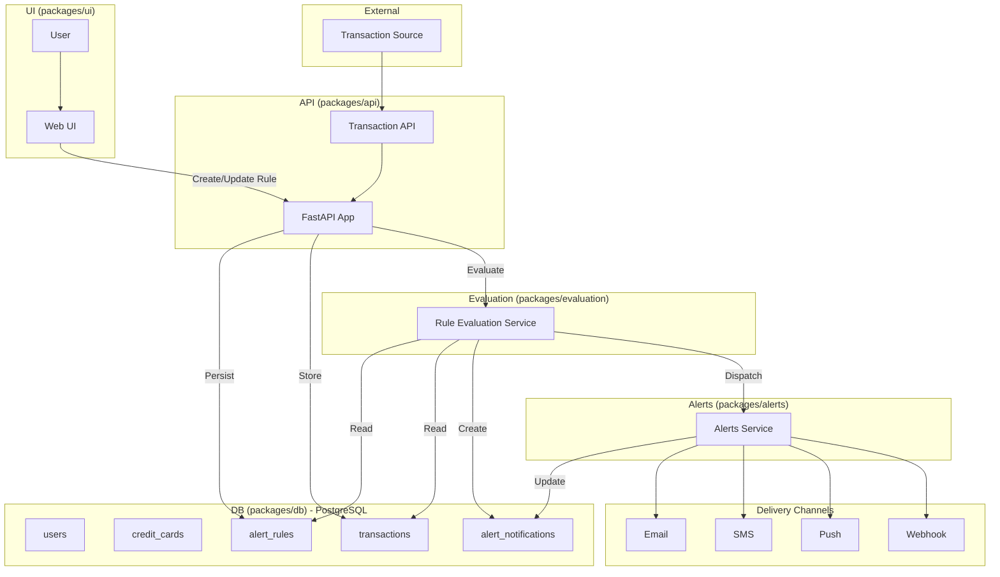

<!-- omit from toc -->
# Spending Transaction Monitor

Alerting for credit card transactions with rule-based and future natural-language rules.

For contribution guidelines and repo conventions, see [CONTRIBUTING.md](CONTRIBUTING.md).
<!-- omit from toc -->
## Table of contents

- [Overview](#overview)
- [How it works](#how-it-works)
- [Getting started](#getting-started)
- [Components](#components)
- [Standards](#standards)
- [Releases](#releases)
- [Structure](#structure)

## Overview

- Monorepo managed with Turborepo
- UI: React + Vite
- API: FastAPI (async SQLAlchemy)
- DB: PostgreSQL with SQLAlchemy models and Alembic migrations

Packages
- `packages/ui`: web app and Storybook
- `packages/api`: API service and routes
- `packages/db`: models, engine, Alembic, seed/verify scripts
- `packages/ingestion-service`: transaction ingestion service with Kafka integration
- `packages/evaluation`: rule evaluation (scaffold)
- `packages/alerts`: alert delivery (scaffold)
- `packages/configs/*`: shared ESLint/Prettier configs

## How it works

- Users create alert rules (amount, merchant, category, timeframe, location; notification methods: email/SMS/push/webhook).
- Incoming transactions are stored and evaluated against active rules.
- Triggered rules produce alert notifications which are delivered via configured channels.



## Getting started

Prerequisites: Node 18+, pnpm 9+, Python 3.11+, uv, Podman (preferred) or Docker

Install
```bash
pnpm setup
```

Develop (starts DB, API, UI)
```bash
pnpm dev
```

**Backend-only development** (API + Database with test data)
```bash
pnpm dev:backend     # Complete backend setup + start
pnpm backend:setup   # Setup only (DB + migrations + seed)
pnpm backend:start   # Start API server only (port 8002)
pnpm backend:stop    # Stop database
```

Common tasks
```bash
pnpm build
pnpm test
pnpm lint
pnpm format
pnpm db:revision
pnpm db:verify
```

Dev URLs
- Web UI: http://localhost:5173  
- API (full stack): http://localhost:8000
- API (backend-only): http://localhost:8002
- API Docs: http://localhost:8002/docs
- Component Storybook: http://localhost:6006

Manual DB control (optional)
```bash
pnpm db:start    # podman compose (fallback to docker compose)
pnpm db:upgrade
pnpm db:seed
pnpm db:stop
```

Python virtual environments
```bash
# Each Python package uses uv-managed venvs under the package directory
pnpm --filter @spending-monitor/api install:deps
pnpm --filter @spending-monitor/db install:deps
```

## Components

- API (`packages/api`): health, users, transactions; async DB session; foundation for rule evaluation and NLP integration
- DB (`packages/db`): SQLAlchemy models, Alembic migrations, seed/verify; local Postgres via Podman/Docker
- UI (`packages/ui`): React app and components in Storybook

## Standards

- Conventional Commits; commitlint enforces messages
- Branch names must match: `feat/*`, `fix/*`, `chore/*`, `docs/*`, `refactor/*`, `test/*`, `ci/*`, `build/*`, `perf/*`
- Hooks
  - pre-commit: UI Prettier/ESLint; API Ruff format/check on staged files
  - pre-push: format:check, lint, test; commitlint on commit range; branch name check

## Releases

Automated with semantic-release on CI, using commit messages to drive versioning and changelogs. Configuration in `.releaserc`.

## Structure

```
spending-transaction-monitor/
├── packages/
│   ├── api/
│   ├── db/
│   ├── ui/
│   ├── ingestion-service/
│   └── configs/
├── docs/
├── turbo.json
├── pnpm-workspace.yaml
└── package.json
```
