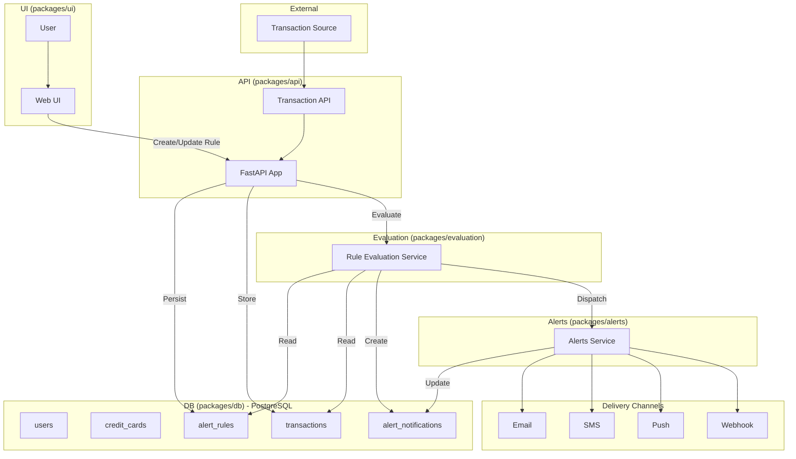

# Spending Transaction Monitor

An **AI-driven application** that enables users to define **natural language alert rules** for their credit card transactions. The system ingests real-time data, evaluates transactions against user-defined rules, applies AI/ML analysis for anomaly detection, and sends alerts through preferred channels such as email or SMS.

## 🚀 Overview

The Spending Transaction Monitor acts as an intelligent intermediary between credit card transaction streams and customers.  

- Users define alert rules in **plain natural language** (e.g., *“Alert me if I spend more than $200 at restaurants this month”*).  
- The system ingests transaction events in real-time.  
- An **NLP engine** converts rules into structured criteria.  
- A **rule engine** evaluates each new transaction against rules, user data, and behavioral patterns.  
- Alerts are triggered and delivered via email, or SMS notification.  

This project demonstrates how to combine **OpenShift AI, and modern ML frameworks** to deliver real-time, user-centric financial monitoring.


## 🏗 Architecture

The solution is deployed on **OpenShift** and integrates multiple components:

- **Transaction Ingestion Service**: Securely receives credit card transaction data in real-time and stores that in the database.  
- **Transaction Data Store**: Stores both historical and streaming data (PostgreSQL).  
- **Customer UI**: React frontend for defining and managing alerts.  
- **NLP Module (LlamaStack + LangGraph Agent)**: Parses natural language into machine-readable rules.  
- **Rules Engine / Alerting Service**: Evaluates transactions against user rules and behavioral patterns.  
- **AI/ML Behavioral Analysis**: Detects anomalies, spending spikes, and recurring patterns.  
- **Notification Service**: Sends alerts via email, or SMS.  



## ✨ Features

- **Natural Language Rule Creation**  
  Define alerts in everyday language (e.g., *“Notify me if I spend 3x more than usual on dining”*).

- **Flexible Rule Management**  
  Add, delete, or pause rules at any time through the UI.

- **Behavioral AI Analysis**  
  Detect anomalies such as unusual merchant categories, high-frequency spending, or out-of-pattern locations.

- **Location-Aware Alerts**  
  Compare transaction location with user’s home, last transaction, or last mobile location.

- **Historical Spend Analysis**  
  Evaluate transactions against aggregated historical trends (e.g., *monthly average dining spend*).

- **Multi-Channel Notifications**  
  Deliver alerts via **Email**, or **SMS**.

## 📦 Technology Stack

- **Frontend**: React  
- **Backend**: FastAPI, Python
- **Databases**: PostgreSQL (transactions, rules, users)  
- **AI/ML**: LlamaStack, LangGraph, TensorFlow/PyTorch, RHOAI  
- **Deployment**: OpenShift, Kubernetes-native microservices  
- **Notifications**: Email, SMS

## 📊 Example Alert Rules

| Category              | Example Trigger                                                                 |
|-----------------------|---------------------------------------------------------------------------------|
| **Spending Pattern**  | “Your dining expense of $98 is 45% higher than your average of $67 over 30 days.”|
| **Recurring Payment** | “Netflix charged $18.99 this month vs. your usual $15.49 — a 22% increase.”      |
| **Location-Based**    | “Transaction in Boston detected. Your last known location was Los Angeles.”      |
| **Merchant-Based**    | “Uber ride was $47.89, up from your last 5 ride average of $28.40.”              |

## 📂 Repository Structure

```
spending-transaction-monitor/
├── packages/
│   ├── api/
│   ├── db/
│   ├── ui/
│   ├── ingestion-service/
│   └── configs/
├── docs/
├── deploy/
├── .env.example
├── turbo.json
├── Makefile
├── pnpm-workspace.yaml
├── package.json
└── README.md
```

## ⚙️ Getting Started

### Prerequisites

- OpenShift cluster with **RHOAI**
- PostgreSQL instance  
- Python 3.11+  
- Node.js 18+  

### Setup

```bash
# Clone the repo
git clone https://github.com/rh-ai-quickstart/spending-transaction-monitor.git
cd spending-transaction-monitor
```

## 🐳 Container Deployment (Recommended)

### 🚀 Quick Start with Podman Compose

**Start with pre-built images:**

```bash
make run-local
```

**Build and run from source:**

```bash
make build-run-local
```

**Container URLs:**

- Frontend: http://localhost:3000
- API: http://localhost:3000/api/* (proxied)
- API Docs: http://localhost:8000/docs
- SMTP Web UI: http://localhost:3002
- Database: localhost:5432

**Container Management:**

```bash
make run-local      # Start with registry images
make build-local    # Build images from source
make build-run-local # Build and start
make stop-local     # Stop all services
make logs-local     # View service logs
make reset-local    # Reset with fresh data
```

## 🧪 Testing Alert Rules

After starting the application with `make run-local`, you can test alert rules interactively:

### **Interactive Alert Rule Testing**

**List available sample alert rules:**

```bash
make list-alert-samples
```

Shows all available test scenarios with their descriptions, such as:

- "Alert when spending more than $500 in one transaction"
- "Alert me if my dining expense exceeds the average of the last 30 days by more than 40%"
- "Alert me if a transaction happens outside my home state"

**Interactive testing menu:**

```bash
make test-alert-rules
```

This command provides:

- 📋 **Alert Rule Menu** showing alert rule descriptions
- 📊 **Data preview** with realistic transaction data adjusted to current time
- 🔍 **User context** showing the test user profile and transaction history
- ✅ **Confirmation prompt** before running the actual test

## 📧 Validating the Alert Notification

After confirming a rule test:

1. The system sends a test notification via the configured **test SMTP server**.
2. To verify:
   - Open the SMTP server Web UI:  
     👉 [http://localhost:3002](http://localhost:3002)
   - Check the inbox for the test email.
   - Open the email to confirm:
     - The **rule name/description** is included.
     - The **transaction details** that triggered the rule are shown.

### **Example Workflow**

1. **Start the application:**

   ```bash
   make run-local
   ```

2. **Browse available test scenarios:**

   ```bash
   make list-alert-samples
   ```

3. **Run interactive testing:**

   ```bash
   make test-alert-rules
   ```

   - Select an alert rule by number (1-16)
   - Review the data preview showing exactly what will be tested
   - Confirm to proceed with the test
   - Watch the complete validation and creation process

### **What the Test Does**

The test process:

1. **Seeds database** with realistic user and transaction data
2. **Validates the alert rule** using the NLP validation API
3. **Creates the alert rule** if validation passes
4. **Shows step-by-step results** including SQL queries and processing steps

**Note:** Make sure the API server is running (`make run-local`) before testing alert rules.

### ☁️ OpenShift Deployment

**Quick Deploy:**

```bash
make full-deploy
```

**Step-by-step:**

```bash
# Login and setup
make login
make create-project

# Build and push images
make build-all
make push-all

# Deploy
make deploy
```

**OpenShift Management:**

```bash
make deploy           # Deploy to OpenShift
make undeploy         # Remove deployment
make status           # Check deployment status
make logs-api         # View API logs
make logs-ui          # View UI logs
```

## 🙌 Contributing

Contributions are welcome! Please fork the repo and submit a PR.  
See our [CONTRIBUTING.md](CONTRIBUTING.md) for guidelines.

## 📜 License

This project is licensed under the **Apache License 2.0**. See [LICENSE](LICENSE) for details.
