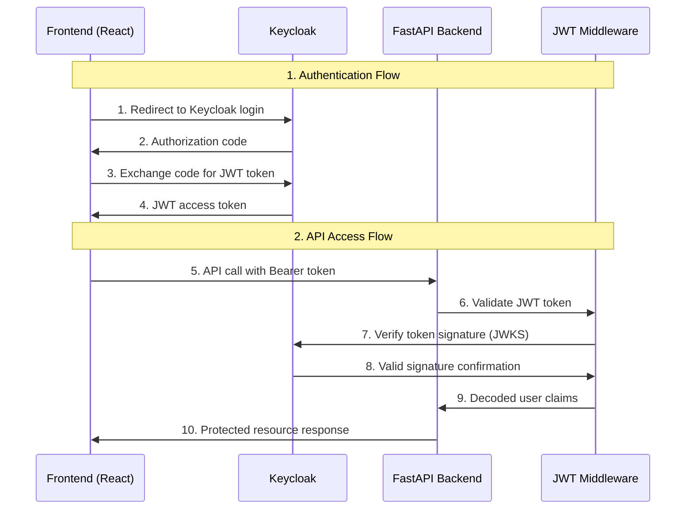

# 🔐 Authentication Infrastructure

Complete OAuth2/OIDC authentication system using **Keycloak** for the Spending Monitor application.

## 🏗️ Architecture Overview



## 🎯 Key Features

- **🔑 JWT Validation** - RS256 signature verification with Keycloak JWKS
- **🛡️ Role-Based Access** - Fine-grained authorization (`admin`, `user` roles)
- **🔄 OIDC Discovery** - Automatic configuration with graceful fallback
- **⚡ Performance** - Token and config caching (1-hour expiry)
- **🧪 Comprehensive Testing** - 27 tests covering all scenarios
- **🚀 Production Ready** - Security best practices and error handling

## 📦 Components

| Component | Description | Location |
|-----------|-------------|----------|
| **JWT Middleware** | Token validation, role-based access | `packages/api/src/auth/middleware.py` |
| **Keycloak Setup** | Automated realm/client configuration | `packages/auth/scripts/setup_keycloak.py` |
| **Test Suite** | 27 comprehensive tests + E2E validation | `packages/auth/tests/` |
| **Documentation** | Integration guides and testing docs | [`INTEGRATION.md`](./INTEGRATION.md), [`TESTING.md`](./TESTING.md) |

> **Frontend Integration**: OIDC client with `react-oidc-context` will be delivered in a separate PR

## 🚀 Quick Start

```bash
# 1. Start services & setup Keycloak
cd packages/auth
./scripts/auth-dev.sh services-up
./scripts/auth-dev.sh setup

# 2. Test the integration  
cd packages/api
uv run uvicorn src.main:app --reload
curl http://localhost:8000/health               # ✅ Works (public endpoint)  
curl http://localhost:8000/users/profile            # ⚠️  Currently works but will require auth when enabled
```

**For detailed setup and integration:** See [`INTEGRATION.md`](./INTEGRATION.md)

## 🛠️ Usage Examples

### **Protect Any API Route**
```python
from ..auth.middleware import require_authentication

@router.get('/protected')
async def protected_route(user: dict = Depends(require_authentication)):
    return {"user_id": user["id"], "roles": user["roles"]}
```

### **Role-Based Access**
```python
from ..auth.middleware import require_role

@router.get('/admin')  
async def admin_route(user: dict = Depends(require_role('admin'))):
    return {"message": "Admin access granted"}
```

**For complete integration patterns:** See [`INTEGRATION.md`](./INTEGRATION.md)

## 🧪 Testing

```bash
# Run all 27 auth tests
pnpm --filter @spending-monitor/api test

# E2E validation
./scripts/auth-dev.sh test
```

**For comprehensive testing approaches:** See [`TESTING.md`](./TESTING.md)

## 🔒 Security & Production

- ✅ **JWT Signature Validation** with Keycloak JWKS  
- ✅ **Role-Based Authorization** with comprehensive error handling
- ✅ **OIDC Discovery + Fallback** for robust configuration
- ✅ **Token Caching** (1-hour expiry) for performance
- ✅ **Production Security Checklist** implemented

## 🛣️ Roadmap

| Phase | Status | Components |
|-------|--------|------------|
| **Backend Foundation** | ✅ **Complete** | JWT middleware, role-based access, testing |
| **Frontend Integration** | 🔄 **Next PR** | React OIDC client, login UI, protected routes |
| **Advanced Features** | 📋 **Future** | Multi-tenant, audit logging, SSO |

## 📚 Documentation

- **[Integration Guide](./INTEGRATION.md)** - Detailed setup and usage patterns
- **[Testing Guide](./TESTING.md)** - Comprehensive testing approaches  
- **[API Docs](http://localhost:8000/docs)** - Interactive OpenAPI documentation

---

**Production-ready backend auth infrastructure providing secure, scalable authentication foundation.** 🎉