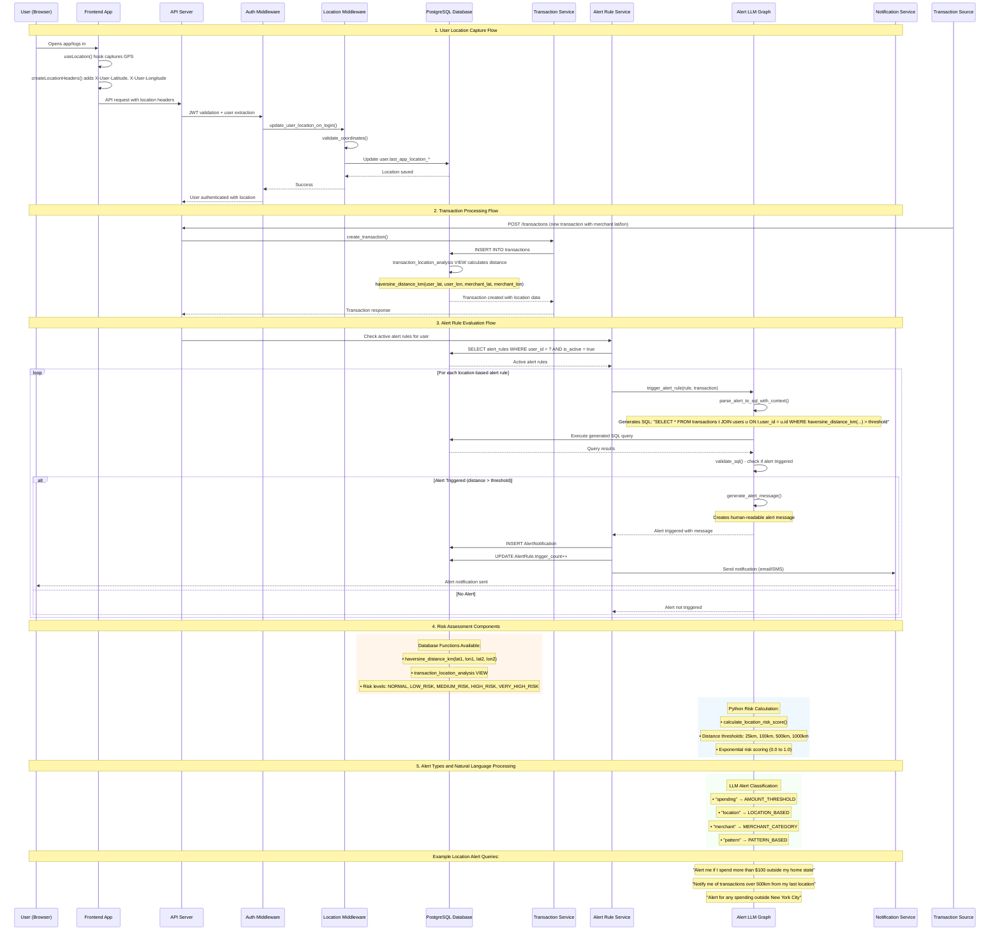

# Location-Based Fraud Detection - Sequence Diagram

## Key Components & Flow Summary

### 1. **Location Capture**
- Browser's Geolocation API captures user's current location
- Location headers (`X-User-Latitude`, `X-User-Longitude`) sent with API requests
- Auth middleware automatically captures and updates user location in database

### 2. **Transaction Processing**
- Transactions include merchant location (latitude/longitude)
- Database calculates distance using Haversine formula via SQL function
- `transaction_location_analysis` VIEW provides real-time risk assessment

### 3. **Alert Rule System**
- Users create natural language alert rules (e.g., "Alert me for spending over $100 more than 500km away")
- LLM parses natural language into SQL queries
- SQL queries use `haversine_distance_km()` function for location-based conditions

### 4. **Risk Scoring**
- **Distance Thresholds:** 25km (LOW), 100km (MEDIUM), 500km (HIGH), 1000km+ (VERY HIGH)
- **Risk Score:** Exponential function from 0.0 (no risk) to 1.0 (maximum risk)
- **Real-time Evaluation:** Every transaction is evaluated against active alert rules

### 5. **Notification System**
- Triggered alerts create `AlertNotification` records
- Notifications sent via email/SMS through configured channels
- Alert rules track trigger count and last triggered time

## Technical Features

- **Offline Geocoding:** Built-in city coordinates lookup for 150+ major cities
- **PostGIS Compatible:** Can use PostGIS ST_Distance for enhanced geospatial operations
- **Privacy Controls:** User consent management for location data
- **Development Mode:** Mock location data for testing without GPS access
- **Haversine Formula:** Accurate great-circle distance calculations

