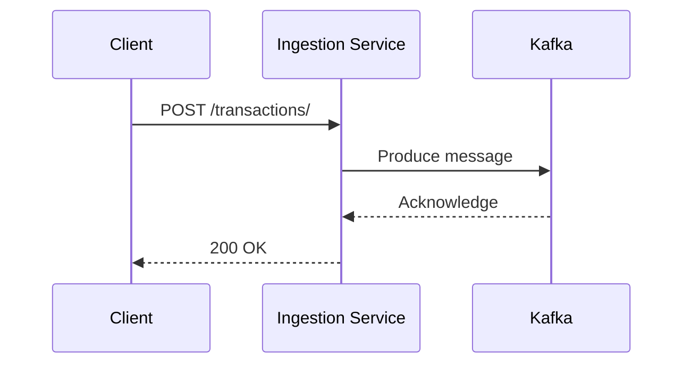

# Ingestion Service

This project contains a transaction ingestion service that receives transaction data, validates it, and pushes it to a Kafka topic for downstream processing. The service is implemented in Python and can be deployed to Kubernetes using Helm.

## Transaction Flow

The following diagram illustrates the flow of a transaction from a client to the ingestion service and into Kafka:



## Getting Started

This section provides instructions on how to work with the Python implementation of the ingestion service (`ingestion-service-py`).

### Prerequisites

*   Python 3.9+
*   Podman
*   kubectl
*   Helm

### Local Development

**Note:** The service requires a running Kafka instance. For local development, you can use the provided Compose file to start Kafka: `podman-compose -f deploy/kafka/compose.yaml up -d`

1.  **Install dependencies:**

    ```bash
    pip install -r ingestion-service-py/requirements.txt
    ```

2.  **Run the service:**

    The service will be available at `http://localhost:8000`.

    ```bash
    export KAFKA_HOST=localhost
    export KAFKA_PORT=9092
    uvicorn ingestion-service-py.main:app --host 0.0.0.0 --port 8000
    ```

3.  **Run tests:**

    ```bash
    python -m pytest ingestion-service-py/test_main.py
    ```

### Building and Pushing the Container Image

1.  **Login to your container registry (e.g., quay.io):**

    ```bash
    podman login quay.io
    ```

2.  **Build and push the image:**

    Replace `<your-username>` with your container registry username.

    ```bash
    cd ingestion-service-py
    podman build -t quay.io/<your-username>/ingestion-service-py:latest .
    podman push quay.io/<your-username>/ingestion-service-py:latest
    cd ..
    ```

### Deployment

The ingestion service and Kafka are deployed to Kubernetes using Helm. The charts include sensible defaults that work out-of-the-box for local development and can be customized for production.

#### Quick Start (Local Development)

Perfect for KinD, Minikube, or other local Kubernetes:

```bash
# 1. Build and push your container image
cd ingestion-service-py
podman build -t quay.io/your-username/ingestion-service-py:latest .
podman push quay.io/your-username/ingestion-service-py:latest
cd ..

# 2. Deploy with your image
make -C deploy install-kafka
make -C deploy install-ingestion-py IMAGE_REPOSITORY=quay.io/your-username/ingestion-service-py IMAGE_TAG=latest
```

This creates a single-replica Kafka cluster with ephemeral storage and automatically connects the ingestion service using your custom image.

#### Production Deployment

For production environments with persistence and high availability:

```bash
# Deploy Kafka with production settings
helm install prod-kafka ./deploy/kafka \
  --set kafka.cluster.replicas=3 \
  --set kafka.storage.type=persistent \
  --set kafka.storage.size=10Gi

# Deploy ingestion service with scaling
helm install prod-ingestion ./deploy/ingestion-service-py/helm \
  --set kafka.host=prod-kafka-kafka-kafka-bootstrap \
  --set replicaCount=3 \
  --set resources.requests.cpu=100m \
  --set resources.requests.memory=128Mi
```

#### 📚 **Comprehensive Deployment Guide**

See [`deploy/INSTALL.md`](deploy/INSTALL.md) for detailed scenarios including:
- Local development with KinD
- Custom release names for multiple environments  
- Production deployment with persistence and HA
- Cross-namespace deployments
- Environment-specific configuration files

### Testing with cURL

1.  **Port-forward the service:**

    ```bash
    kubectl port-forward svc/ingestion-py 8080:80
    ```

2.  **Send a test transaction:**

    ```bash
    curl -X POST "http://localhost:8080/transactions/" \
    -H "Content-Type: application/json" \
    -d '{
        "user": 1,
        "card": 1,
        "year": 2023,
        "month": 1,
        "day": 1,
        "time": "12:00:00",
        "amount": 10.00,
        "use_chip": "Swipe Transaction",
        "merchant_id": 123456789,
        "merchant_city": "New York",
        "merchant_state": "NY",
        "zip": "10001",
        "mcc": 5411,
        "errors": "",
        "is_fraud": false
    }'
    ```

## Data Model

The common data model is defined in the `ingestion-service-py/common` directory. It consists of three main entities: `Transaction`, `User`, and `Card`.

### Transaction

| Field          | Type     | Description                                |
|----------------|----------|--------------------------------------------|
| user           | int      | The ID of the user who made the transaction. |
| card           | int      | The ID of the card used for the transaction. |
| year           | int      | The year of the transaction.               |
| month          | int      | The month of the transaction.              |
| day            | int      | The day of the transaction.                |
| time           | string   | The time of the transaction (HH:MM:SS).    |
| amount         | float    | The amount of the transaction.             |
| use_chip       | str      | The method used for the transaction.       |
| merchant_id    | int      | The ID of the merchant.                    |
| merchant_city  | str      | The city of the merchant.                  |
| merchant_state | str      | The state of the merchant.                 |
| zip            | str      | The zip code of the merchant.              |
| mcc            | int      | The Merchant Category Code.                |
| errors         | str      | Any errors associated with the transaction.|
| is_fraud       | boolean  | Whether the transaction is fraudulent.     |

## Test Data

The data used for testing is a subset of the [Credit Card Transactions](https://www.kaggle.com/datasets/ealtman2019/credit-card-transactions) dataset from Kaggle. The subset is located in the `data` directory and contains 1000 transactions, along with the corresponding user and card data.
