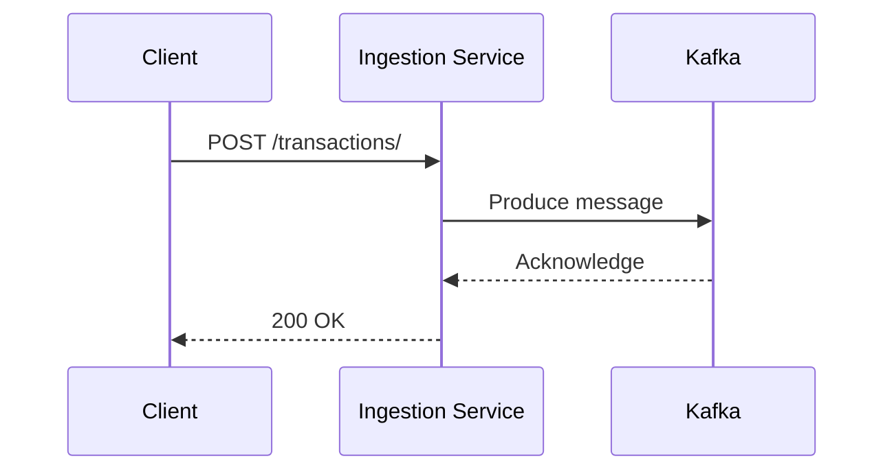

# Ingestion Service

This is a Python-based transaction ingestion service built with FastAPI. It receives transaction data via REST API, validates it, transforms it, and produces messages to a Kafka topic for downstream processing. The service uses `kafka-python` for Kafka integration and can be deployed to Kubernetes using Helm.

## Transaction Flow

The following diagram illustrates the flow of a transaction from a client to the ingestion service and into Kafka:



## Getting Started

This section provides instructions on how to work with the Python FastAPI implementation of the ingestion service.

### Prerequisites

*   Python 3.11+ (make sure `python3` command is available)
*   [uv](https://docs.astral.sh/uv/) - Modern Python package manager (recommended) or pip
*   Podman (or Docker)
*   Node.js/npm or pnpm (for running npm scripts)
*   kubectl (for Kubernetes deployments)
*   Helm (for Kubernetes deployments)

**Note:** This service requires Python 3.11+. You can verify with:
```bash
python3 --version  # Should show Python 3.11+
which python3      # Should point to Python 3 installation

# Install uv if not available
pip install uv
# or: curl -LsSf https://astral.sh/uv/install.sh | sh
```

### Local Development

#### 1. Start Kafka Locally

The ingestion service requires a running Kafka instance. Choose one of the following options:

**Option A: Using npm scripts (Recommended)**
```bash
# Start Kafka with Zookeeper
npm run kafka:start

# Check status
npm run kafka:status

# View Kafka logs
npm run kafka:logs

# Stop Kafka and cleanup
npm run kafka:stop
```

**Option B: Using podman-compose directly**
```bash
# Start Kafka using Confluent images
podman-compose -f deploy/kafka/compose.yaml up -d

# Stop and cleanup
podman-compose -f deploy/kafka/compose.yaml down
```

**Option C: Using Docker Compose (if using Docker instead of Podman)**
```bash
# Start Kafka using Confluent images
podman-compose -f deploy/kafka/compose.yaml up -d

# Stop and cleanup
podman-compose -f deploy/kafka/compose.yaml down
```

#### 2. Install Dependencies and Run the Service

1.  **Set up Python environment and dependencies:**

    ```bash
    # Install all dependencies including dev tools (recommended)
    npm run install:deps
    # or: pnpm run install:deps
    ```
    
    This uses `uv` (Python package manager) to create a virtual environment and install all dependencies automatically.
    
    **Manual setup (alternative):**
    ```bash
    # Install uv first if not available
    pip install uv
    
    # Install dependencies manually
    uv sync --extra dev
    ```

2.  **Run the ingestion service:**

    The service will be available at `http://localhost:8001`.

    ```bash
    # Development mode with auto-reload (recommended)
    npm run dev
    # or: pnpm run dev
    
    # Production mode  
    npm run start
    # or: pnpm run start
    
    # Manual (alternative) - using uv directly
    KAFKA_HOST=localhost KAFKA_PORT=9092 uv run uvicorn src.main:app --reload --host 0.0.0.0 --port 8001
    ```

#### 3. Verify Setup

1.  **Check Kafka is running:**

    ```bash
    npm run kafka:status
    # Should show kafka and zookeeper containers as healthy
    ```

2.  **Test the ingestion service:**

    ```bash
    curl -X GET "http://localhost:8001/health"
    # Should return {"status": "ok"}
    ```

3.  **Run tests:**

    We provide multiple ways to run tests for maximum reliability:

    ```bash
    # Run unit tests only (no external dependencies needed)
    npm run test:unit         # or: pnpm run test:unit
    
    # Run E2E tests (requires service + Kafka running)  
    npm run test:e2e          # or: pnpm run test:e2e
    
    # Run all tests (unit + E2E)
    npm run test:all          # or: pnpm run test:all
    
    # Run unit tests (default - fastest for development)
    npm run test              # or: pnpm run test
    ```

    **Test Organization:**
    - **`tests/unit/`** - Unit tests with mocked dependencies (run by default)
    - **`tests/integration/`** - Integration tests (currently ignored)
    - **`tests/e2e/`** - End-to-end tests requiring real Kafka (skipped by default)

    **Alternative: Using Makefile** (comprehensive test suite):
    ```bash
    make test                   # All tests (service validation + unit + integration)
    make test-unit             # Unit tests only
    make test-integration      # Integration tests with service validation
    make help                  # Show all available make targets
    ```
    
    > 💡 **Note:** `make test` includes service validation, unit tests, and integration tests using FastAPI TestClient. This is more comprehensive than `npm run test` and validates the entire service stack.

    **Alternative: Using pytest directly** (with venv activated):
    ```bash
    cd packages/ingestion-service
    uv run pytest tests/unit/ -v           # Unit tests only
    uv run pytest tests/e2e/ -v -s         # E2E tests (requires Kafka)
    uv run pytest --ignore=tests/e2e/      # All except E2E
    ```

### Building and Pushing the Container Image

1.  **Login to your container registry (e.g., quay.io):**

    ```bash
    podman login quay.io
    ```

2.  **Build and push the image:**

    Replace `<your-username>` with your container registry username.

    ```bash
    # Using npm script (recommended)
    npm run build:docker
    
    # Or manually build and push
    podman build -t quay.io/<your-username>/ingestion-service:latest .
    podman push quay.io/<your-username>/ingestion-service:latest
    ```

### Deployment

The ingestion service and Kafka are deployed to Kubernetes using Helm. The charts include sensible defaults that work out-of-the-box for local development and can be customized for production.

#### Quick Start (Local Development)

Perfect for KinD, Minikube, or other local Kubernetes:

```bash
# 1. Build and push your container image
podman build -t quay.io/your-username/ingestion-service:latest .
podman push quay.io/your-username/ingestion-service:latest

# 2. Deploy with your image
make -C deploy install-kafka
make -C deploy install-ingestion-py IMAGE_REPOSITORY=quay.io/your-username/ingestion-service IMAGE_TAG=latest
```

This creates a single-replica Kafka cluster with ephemeral storage and automatically connects the ingestion service using your custom image.

#### Production Deployment

For production environments with persistence and high availability:

```bash
# Option 1: Deploy your own Kafka with production settings
helm install prod-kafka ./deploy/kafka \
  --set kafka.cluster.replicas=3 \
  --set kafka.storage.type=persistent \
  --set kafka.storage.size=10Gi

# Deploy ingestion service connecting to your Kafka
make -C deploy install-ingestion-py \
  KAFKA_RELEASE_NAME=prod-kafka \
  IMAGE_REPOSITORY=your-registry.com/ingestion-service-py \
  IMAGE_TAG=v1.0.0

# Option 2: Connect to external/cloud Kafka
make -C deploy install-ingestion-py \
  KAFKA_HOST=kafka.your-company.com \
  KAFKA_PORT=9092 \
  IMAGE_REPOSITORY=your-registry.com/ingestion-service-py \
  IMAGE_TAG=v1.0.0
```

#### 📚 **Comprehensive Deployment Guide**

See [`deploy/INSTALL.md`](deploy/INSTALL.md) for detailed scenarios including:
- Local development with KinD
- Custom release names for multiple environments  
- Production deployment with persistence and HA
- Cross-namespace deployments
- Environment-specific configuration files

### Quick Start Guide

For a quick local development setup:

```bash
# 1. Clone and navigate to the ingestion service
cd packages/ingestion-service

# 2. Install dependencies  
npm run install:deps

# 3. Start Kafka and Zookeeper
npm run kafka:start

# 4. Start the ingestion service
npm run dev

# 5. Verify everything is working
curl http://localhost:8001/health
```

The ingestion service will be available at `http://localhost:8001` and Kafka will be running on `localhost:9092`.

### Additional Development Commands

```bash
# Code formatting and linting  
npm run format        # Auto-format code with ruff
npm run format:check  # Check formatting without changes
npm run lint         # Check code with ruff
npm run lint:fix     # Auto-fix linting issues
npm run type-check   # Type checking with mypy

# Container building
npm run build:docker # Build container image with podman

# Helm chart validation
npm run helm:lint    # Lint Helm charts
```

### Testing with cURL

#### Local Testing (Development Mode)

1.  **Send a test transaction to the local service:**

    ```bash
    curl -X POST "http://localhost:8001/transactions/" \
    -H "Content-Type: application/json" \
    -d '{
        "user": 1,
        "card": 1,
        "year": 2023,
        "month": 1,
        "day": 1,
        "time": "12:00:00",
        "amount": 10.00,
        "use_chip": "Swipe Transaction",
        "merchant_id": 123456789,
        "merchant_city": "New York",
        "merchant_state": "NY",
        "zip": ""10001"",
        "mcc": 5411,
        "errors": "",
        "is_fraud": false
    }'
    ```

#### Kubernetes Testing

1.  **Port-forward the service (for Kubernetes deployments):**

    ```bash
    kubectl port-forward svc/ingestion-py 8080:80
    ```

2.  **Send a test transaction:**

    ```bash
    curl -X POST "http://localhost:8080/transactions/" \
    -H "Content-Type: application/json" \
    -d '{
        "user": 1,
        "card": 1,
        "year": 2023,
        "month": 1,
        "day": 1,
        "time": "12:00:00",
        "amount": 10.00,
        "use_chip": "Swipe Transaction",
        "merchant_id": 123456789,
        "merchant_city": "New York",
        "merchant_state": "NY",
        "zip": ""10001"",
        "mcc": 5411,
        "errors": "",
        "is_fraud": false
    }'
    ```

### Troubleshooting

#### Common Issues

**Kafka Connection Issues:**
```bash
# Check if Kafka containers are running
npm run kafka:status

# Check Kafka logs for errors
npm run kafka:logs

# Restart Kafka if needed
npm run kafka:restart
```

**Port Conflicts:**
- Kafka uses port `9092` and Zookeeper uses port `2181`
- Ingestion service uses port `8001`
- Make sure these ports are not in use by other applications

**Python Version Issues:**
```bash
# Check Python version (should be 3.12+)
python3 --version

# If python3 is not found, install Python 3:
# On macOS: brew install python@3.12
# On Ubuntu: sudo apt install python3.12 python3.12-venv python3.12-pip
# On RHEL/Fedora: sudo dnf install python3.12 python3.12-pip
```

**Virtual Environment Issues:**
```bash
# Check if virtual environment exists (uv manages this automatically)
ls .venv

# Reinstall dependencies if needed
npm run install:deps

# Check if dependencies are installed
uv run python -c "import uvicorn; print('uvicorn installed')"
uv run python -c "import fastapi; print('fastapi installed')"
```

**Import/Module Issues:**
```bash
# Test imports directly with uv
uv run python -c "from src.main import app; print('main module imported successfully')"
uv run python -c "from src.common.models import Transaction; print('models imported successfully')"
```

**Environment Variables:**
```bash
# Check if environment variables are set correctly
echo $KAFKA_HOST  # Should be localhost
echo $KAFKA_PORT  # Should be 9092
```

**Service Health:**
```bash
# Check ingestion service health
curl http://localhost:8001/health

# List Kafka topics (should include 'transactions')
npm run kafka:topics
```

## Data Model

The common data model is defined in the `src/common` directory. It consists of three main entities: `Transaction`, `User`, and `Card`.

### Transaction

| Field          | Type     | Description                                |
|----------------|----------|--------------------------------------------|
| user           | int      | The ID of the user who made the transaction. |
| card           | int      | The ID of the card used for the transaction. |
| year           | int      | The year of the transaction.               |
| month          | int      | The month of the transaction.              |
| day            | int      | The day of the transaction.                |
| time           | string   | The time of the transaction (HH:MM:SS).    |
| amount         | float    | The amount of the transaction.             |
| use_chip       | str      | The method used for the transaction.       |
| merchant_id    | int      | The ID of the merchant.                    |
| merchant_city  | str      | The city of the merchant.                  |
| merchant_state | str      | The state of the merchant.                 |
| zip            | str      | The zip code of the merchant.              |
| mcc            | int      | The Merchant Category Code.                |
| errors         | str      | Any errors associated with the transaction.|
| is_fraud       | boolean  | Whether the transaction is fraudulent.     |

## Test Data

The data used for testing is a subset of the [Credit Card Transactions](https://www.kaggle.com/datasets/ealtman2019/credit-card-transactions) dataset from Kaggle. The subset is located in the `data` directory and contains 1000 transactions, along with the corresponding user and card data.
